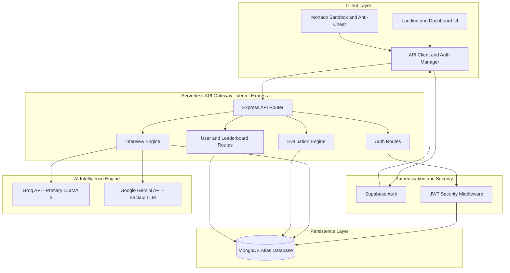

# HireReady — AI-Powered Interview Preparation Platform

> "From Practice to Placement"

🌐 **Live Website**: [https://hire-ready-steel.vercel.app](https://hire-ready-steel.vercel.app)

---

## Tech Stack

| Tech Stack | Technology |
|-------|-----------|
| Frontend | HTML5, CSS3 (CSS Variables), Vanilla JS |
| Backend | Node.js + Express.js |
| Database | MongoDB + Mongoose |
| AI Engine | Groq API (Main) / Gemini API (Backup) |
| Auth | Supabase Auth (OAuth/Email) + JWT Fallback |
| Deployment | Vercel (Serverless Functions) |
| CI/CD | Vercel + GitHub Automated Deployment Pipeline |
| Security | Helmet, Rate Limiting, Input Validation, Account Lockout |

---

## 🏛️ System Architecture

HireReady is built on a modern, decoupled serverless architecture separating static frontend presentation, identity management, serverless API execution, dual LLM inference engines, and cloud data persistence.

### Architecture Diagram



### Component Breakdown

1. **Client Layer (Frontend)**
   - **Responsive UI**: Lightweight HTML5/CSS3 single-page navigation styled with CSS custom variables (dark and light themes).
   - **Interactive Sandbox & Anti-Cheat Engine**: Client-side code editor for live coding challenges integrated with anti-cheat telemetry (monitoring tab switches, copy-paste events, and window focus loss).

2. **Authentication & Security**
   - **Dual Authentication**: Combines Supabase Auth (for secure email confirmation and OAuth) with server-verified JWT authorization headers across protected API endpoints.

3. **Serverless API Gateway**
   - **Express Micro-routing**: Serves as the central API entry point (`/api/*`), optimized for Vercel Serverless Functions with MongoDB connection pooling, rate limiting, and Helmet security protection.

4. **AI Intelligence Engine**
   - **Dynamic Interview Engine**: Generates role-tailored and resume-based questions with adaptive difficulty.
   - **Dual LLM Architecture**: Uses **Groq API** as the primary high-speed inference engine for real-time interview dialog, seamlessly failing over to **Google Gemini API** when needed.
   - **Evaluation Engine**: Computes technical accuracy, filler word counts, sentiment indicators, and overall Role Readiness Scores.

5. **Persistence Layer**
   - **MongoDB Atlas**: Cloud database storing user accounts, interview logs, coding submissions, evaluation metrics, and streak/leaderboard standings.

---

## 🚀 Deploying on Vercel

1. Push your repository to GitHub.
2. Import the repository into [Vercel](https://vercel.com).
3. Add the following **Environment Variables** in Vercel settings:
   - `MONGODB_URI`: Your MongoDB Atlas connection string.
   - `GROQ_API_KEY`: Groq API key from console.groq.com (Primary AI).
   - `GEMINI_API_KEY`: Gemini API key (Backup AI).
   - `SUPABASE_URL`: Your Supabase Project URL (`https://xyz.supabase.co`).
   - `SUPABASE_ANON_KEY`: Your Supabase Anonymous Key.
4. Click **Deploy**! Vercel will automatically build the static frontend and route API endpoints via `@vercel/node`.

---

## ⚡ Continuous Integration & Continuous Deployment (CI/CD)

HireReady utilizes an automated **CI/CD pipeline** powered by GitHub and Vercel:

- **Automated Webhook Triggers**: Every code commit pushed to the `main` branch automatically initiates a fresh production build.
- **Global Edge & Serverless Compilation**: Static frontend assets are deployed across Vercel's Edge CDN, while Express API routes are compiled into Node.js serverless functions.
- **Zero-Downtime Deployment**: Production traffic seamlessly switches to the new build version upon passing all build and compilation checks.

---

## Project Structure

```
hireready-full/
├── backend/
│   ├── models/
│   │   ├── User.js          # User model with security features
│   │   └── Session.js       # Interview session model
│   ├── routes/
│   │   ├── auth.js          # Register, login, logout, /me
│   │   ├── users.js         # Profile, settings, resume, stats
│   │   ├── interview.js     # Start, message, end, code review, anti-cheat
│   │   ├── evaluation.js    # Fetch evaluations
│   │   ├── leaderboard.js   # Rankings with filters
│   │   └── resources.js     # Curated learning resources
│   ├── middleware/
│   │   └── auth.js          # JWT protect middleware
│   ├── .env.example         # Environment variables template
│   ├── package.json
│   └── server.js            # Main Express server
└── frontend/
    ├── css/
    │   └── main.css         # Full design system, dark + light mode
    ├── js/
    │   └── api.js           # API client, auth manager, theme, toasts
    ├── pages/
    │   ├── login.html
    │   ├── register.html
    │   ├── dashboard.html
    │   ├── interview.html
    │   ├── evaluation.html
    │   ├── leaderboard.html
    │   ├── resources.html
    │   └── settings.html
    └── index.html           # Landing page
```

---

##  Setup Instructions

### Prerequisites
- Node.js 18+
- MongoDB (local or MongoDB Atlas)
- Gemini API Key (for AI features)

### 1. Install backend dependencies

```bash
cd backend
npm install
```

### 2. Configure environment variables

```bash
cp .env.example .env
```

Edit `.env` and fill in:
```
MONGODB_URI=mongodb://localhost:27017/hireready
JWT_SECRET=your_very_long_random_secret_here
GEMINI_API_KEY=gemini_api_key...
```

### 3. Start the server

```bash
# Development
npm run dev

# Production
npm start
```

The server runs on **http://localhost:5000** and serves the frontend automatically.

### 4. Open in browser

Visit: **http://localhost:5000**

Deployed link: **https://hire-ready-steel.vercel.app**

---

##  Features Implemented

### 
- ✅ AI-Based Mock Interview Sessions (Gemini API)
- ✅ Role-Based Interview Simulation (SDE, Data Scientist, DevOps, PM)
- ✅ Technical + HR Rounds
- ✅ Adaptive Follow-up Questions (context-aware AI)
- ✅ Real-time AI Feedback & Scoring
- ✅ Resume Upload & Resume-Based Questions
- ✅ Difficulty Modes (Easy / Medium / Hard)
- ✅ Pressure Mode (AI interruptions, time pressure)
- ✅ Coding Editor (Monaco-style) with AI Code Review
- ✅ Anti-Cheat Detection (tab switching, paste monitoring)
- ✅ AI Evaluation System (technical, communication, confidence)
- ✅ Filler Word Detection (um, uh, like, so, etc.)
- ✅ Confidence Analysis + Sentiment Analysis
- ✅ Weakness Identification + Role Readiness Score
- ✅ Improvement Roadmap (personalized learning path)
- ✅ Leaderboard with Role-based Rankings
- ✅ Daily Streak System
- ✅ Curated Resources (categorized by role, topic, difficulty)
- ✅ Performance Tracking over sessions

### UI/UX
- ✅ Dark Mode (default, matching the slides)
- ✅ Light Mode (same color palette as attached screenshots)
- ✅ Smooth theme switching
- ✅ Responsive design (mobile-friendly)
- ✅ Animated stats, toasts, modals

### Security
- ✅ Password hashing (bcrypt, 12 rounds)
- ✅ JWT authentication (7-day expiry)
- ✅ HTTP-only cookies
- ✅ Account lockout (5 failed attempts → 15 min lock)
- ✅ Rate limiting (general: 200/15min, auth: 20/15min, AI: 60/min)
- ✅ Input validation (express-validator)
- ✅ Helmet security headers
- ✅ CORS protection
- ✅ SQL/NoSQL injection protection (Mongoose sanitization)
- ✅ Passwords never returned in API responses (select: false)

---

##  Team — 

- Khyati Singh (25BCE11336)
- Aayushi (25BCE10206)
- Yashraj (25BAI11556)
- Aryan Kumar (25BCE11350)
- Aishwary Shrivastava (25BCE10306)

---

##  Future Scope (from slides)

- Company-specific interview modes
- Voice & emotion detection AI
- Recruiter dashboard & analytics
- Referral system for top performers
- Mobile app (React Native)

